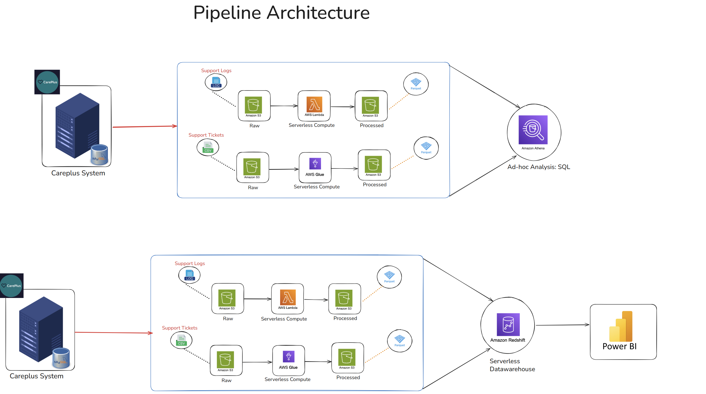

# AWS ETL Careplus Pipeline 🚀

## 📌 Project Overview
This project demonstrates the design and implementation of a **fully automated ETL (Extract, Transform, Load) pipeline** on AWS for the **Careplus system**.  

The pipeline ingests **support logs** (`.log` files) and **support tickets** (`.csv` files) into Amazon S3, performs transformations using **AWS Lambda** and **AWS Glue**, stores the processed data in **Amazon Redshift**, and enables **real-time analytics and visualization in Power BI**.  

The solution is **serverless, automated, and scalable**.

---

## 🏗️ Architecture

---

## ⚙️ Services Used
- **Amazon S3** – Raw and processed data storage  
- **AWS Lambda** – Automated data transformations & Glue triggers  
- **AWS Glue** – ETL for support tickets (.csv → .parquet)  
- **Amazon Athena** – Ad-hoc SQL analysis on processed data  
- **Amazon Redshift (Serverless)** – Data warehouse for analytics  
- **AWS IAM** – Secure access control and role permissions  
- **Power BI** – Visualization and dashboarding  

---

## 📂 Project Structure

aws-etl-careplus-pipeline/  
├── src/          
│   ├── ingestion/                     # Python scripts for uploading raw files to S3  
│   ├── lambda/                        # Lambda function code  
│   └── glue/                          # Glue ETL script(s)  
  ── docs/  
│   ├── pipeline.png                   # Architecture diagram  
│   └── AWS_ETL_Pipeline_Screenshots.pdf  # Console screenshots  
│
└── README.md

## 🔄 Pipeline Workflow
### 1. **Data Ingestion**
- Raw files from Careplus system are uploaded into:
  - `support_logs/raw/`  
  - `support_tickets/raw/`  
- Upload automated using **Python boto3** scripts (`ingestion data to S3.ipynb`).

---

### 2. **Transformation**
- **Support Logs**
  - Triggered by **S3 event notification** on `support_logs/raw/`.
  - Lambda function `automate_support_logs_etl` converts `.log` → `.parquet`.
  - Stores result in `support_logs/processed/`.

- **Support Tickets**
  - Triggered by **S3 event notification** on `support_tickets/raw/`.
  - Lambda function `automate_support_tickets` invokes AWS Glue.
  - Glue ETL script transforms `.csv` → `.parquet`.
  - Stores result in `support_tickets/processed/`.

---

### 3. **Ad-hoc Analysis**
- **Amazon Athena** queries on processed data for quick insights.

---

### 4. **Data Warehouse**
- **Amazon Redshift Serverless** hosts the warehouse `careplus_db`.
- Lambda functions (`increment_automate_logs_load`, `increment_automate_tickets_load`) auto-load `.parquet` files from `processed/` S3 folders into Redshift using `COPY` command.

---

### 5. **Visualization**
- **Power BI** connects to Redshift warehouse.  
- Dashboards auto-refresh when new processed data arrives.  

---

## 📊 Final Output
- Automated pipeline from raw → processed → warehouse → Power BI.  
- Ad-hoc queries in Athena.  
- Dynamic dashboards in Power BI.  
- Serverless, scalable, and cost-efficient architecture.  

---

## 📁 Documentation
👉 Detailed AWS console screenshots: [`docs/AWS_ETL_Pipeline_Screenshots.pdf`](docs/AWS_ETL_Pipeline_Screenshots.pdf)  

---

## 🔐 Security
- **IAM roles** created for Lambda, Glue, and Redshift with least-privilege access.  
- No hardcoded AWS credentials (all access managed via IAM roles).  

---

## 🚀 How to Reproduce
1. Clone this repo.  
2. Deploy AWS services step by step (see screenshots in `docs/`).  
3. Configure S3 buckets and Lambda triggers.  
4. Load processed data into Redshift.  
5. Connect Power BI for visualization.  

---

## 📌 Future Enhancements
- Add **CI/CD pipeline** for deploying Lambda & Glue code.  
- Integrate **AWS Step Functions** for orchestration.  
- Enable **AWS QuickSight** for native AWS dashboards.  

---

## 👨‍💻 Author
**Abdul Rayhaan**  
ETL Pipeline Developer | Data Engineering Enthusiast | Data Analyst 

---
